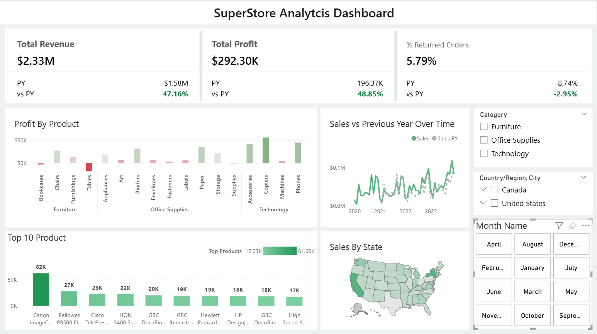

# Superstore Sales Dashboard - Power BI



## Overview

This project presents an **interactive Power BI dashboard** built on the Superstore Sales dataset.  
It provides insights into sales performance, profitability, and return rates across products, categories, and regions.

---

## Data Model

- **Orders**: Category, City, Country/Region, Customer Name, Discount, Order Date, Order ID, Postal Code, Product Name, Profit, Quantity, Region, Sales, Segment, State/Province, Sub-Category.  
- **Returns**: Order ID  
- **Date**: Calendar table for time intelligence  

---

## Key Measures

- **Metrics**
  - % Returned Orders  
  - Profit  
  - Sales  
- **Previous Year (PY) Metrics**
  - % Returned Orders PY  
  - Profit PY  
  - Sales PY  
- **Comparisons**
  - Total Revenue vs PY  
  - Sales by Product  

---

## Features

- Clean and structured data model.  
- KPI cards for top-level metrics (Revenue, Profit, Returns).  
- Sales analysis by Product, Category, Region, and Customer Segment.  
- Year-over-Year performance tracking.  
- Interactive filters and slicers for better exploration.  

---

## Cloning

To clone this repository and explore the project locally:

```bash
git clone https://github.com/your-username/superstore-sales-dashboard.git
cd superstore-sales-dashboard
